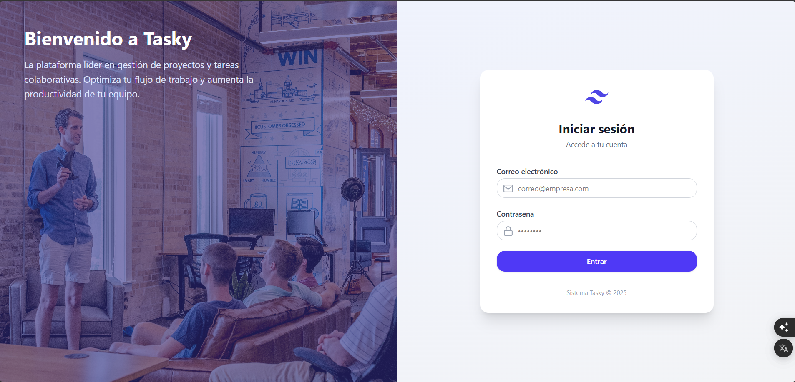

Tasky es un proyecto personal Full Stack que desarrollé para la gestión de tareas.
Es una aplicación web tipo CRUD que permite crear, editar, eliminar y consultar tareas, enfocada en organizar actividades de manera sencilla.
El frontend está desarrollado con React y Tailwind CSS, el backend con .NET mediante una API REST, y la información se almacena en SQL Server.
En este proyecto me encargué de todo el ciclo: diseño de la interfaz, lógica de negocio, conexión con la base de datos y consumo de la API desde el frontend.

